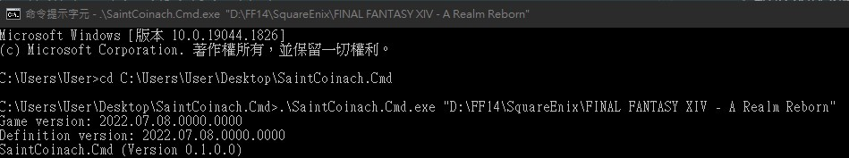

這篇整理 FFXIV（Final Fantasy XIV）取得遊戲資料的各種方式，寫給想自己做**漢化包翻譯**或**工具開發**的人。

先分清楚一件事：FFXIV 的「讀取資料」分**兩種**，搞混會選錯工具。

| 類別 | 讀什麼 | 典型用途 | 代表工具 |
|---|---|---|---|
| **① 靜態遊戲檔案（拆包）** | 遊戲內附的封裝資料：文字表、貼圖、模型、BGM | 漢化／翻譯、資料庫、wiki | SaintCoinach、Lumina、Godbert、EXDViewer、TexTools、XIVAPI |
| **② 執行期記憶體** | 執行中遊戲 process 的即時狀態：座標、目標、隊伍 | overlay、即時計算工具 | sharlayan、Dalamud + FFXIVClientStructs |

> 想做**翻譯**的話，你需要的是 **①**；想做**即時 overlay／外掛**才會用到 **②**。
> 另外提醒：讀取執行期記憶體（②）屬於修改遊戲行為的灰色地帶，可能違反 SQUARE ENIX 使用條款，自行斟酌風險。

---

## 前言：FFXIV 的資料是怎麼存的

要理解拆包在做什麼，得先知道遊戲資料的格式：

- 遊戲安裝目錄下的 `game/sqpack/` 裡是一堆 `.index` / `.index2` / `.dat` 檔，這是 SQUARE ENIX 自家的封裝格式 **SqPack**，把所有資源打包在一起。
- 其中分類 `0a0000`（category 0A）存的是 **「Excel」sheet**（跟微軟 Excel 沒有關係，只是借用這個名字），用來存放表格／關聯式資料，例如道具、任務、技能文字等。
- 一個 Excel sheet 由三種檔案組成：
  - **`.exh`（Excel Header）**：定義欄位的資料結構、分頁、以及有哪些語言。
  - **`.exd`（Excel Data）**：實際的資料列。
  - **`.exl`（Excel List）**：sheet 的索引清單，讓 sheet 可以用名稱查到。

所謂「**拆包**」，就是把這些 binary 還原成人類看得懂的格式（通常是 CSV）。下面的拆包系工具做的都是這件事。

關於格式細節可參考 [XIV Dev Wiki 的 SqPack](https://xiv.dev/data-files/sqpack) 與 [Excel 格式](https://xiv.dev/game-data/file-formats/excel) 說明。

---

# ① 拆包系：讀取靜態遊戲檔案

## SaintCoinach

老牌拆包工具，提供命令列版（SaintCoinach.Cmd）與 GUI 版（Godbert）。本段記錄如何用 SaintCoinach.Cmd 把當前版本的資料匯出成 **CSV**。

1. 至 Github 下載 `SaintCoinach.Cmd.zip`
   <https://github.com/xivapi/SaintCoinach/releases>

2. 將 `SaintCoinach.Cmd.zip` 解壓縮至隨意地方，開啟 CMD 輸入以下指令（第一個參數為 FF14 安裝的路徑）

   ```powershell
   .\SaintCoinach.Cmd.exe "D:\FF14\SquareEnix\FINAL FANTASY XIV - A Realm Reborn"
   ```

   輸入正確會出現以下畫面，**遊戲版本與定義（definition）版本應該要相同**，匯出才會正常：

   

3. 上一步只是進入 SaintCoinach 的**互動式 console**，要再輸入指令才會實際匯出資料：

   ```bash
   # 匯出全部 sheet 成 CSV（不做後處理），也可在後面以空白分隔指定 sheet 名稱
   rawexd

   # 有做後處理（解析欄位關聯）的 CSV 匯出
   exd

   # 其他常用：抽取 UI 圖示 / 背景音樂 / 地圖
   ui
   bgm
   maps
   ```

   匯出的檔案會放在 `SaintCoinach.Cmd.exe` 同層、依遊戲版本命名的資料夾中（例如 `2023.xx.xx.xxxx.xxxx/`）。

> 補充：SaintCoinach 現在算是「舊世代」工具，定義檔（schema）更新速度較慢。新版本若還沒有對應定義，部分 sheet 可能會匯出失敗或缺欄位。新專案建議優先考慮下面的 Lumina。

## Lumina（建議：SaintCoinach 的現代後繼）

[Lumina](https://github.com/NotAdam/Lumina) 是一個專門用來讀 FFXIV 遊戲資料的 .NET 函式庫；連 Dalamud 內部都是用它來存取 sheet。和 SaintCoinach 不同，Lumina 比較適合「在自己的程式裡即時讀取」而不是「一次性匯出 CSV」。

最小使用範例（對應現行 Lumina 7.x，透過 NuGet 安裝 `Lumina`，強型別 sheet 另裝 `Lumina.Generated`）：

```csharp
using Lumina;
using Lumina.Excel.Sheets;

// 指向遊戲的 sqpack 資料夾
var gameData = new GameData(@"D:\FF14\SquareEnix\FINAL FANTASY XIV - A Realm Reborn\game\sqpack");

// 取得 Item 這張 sheet
var itemSheet = gameData.GetExcelSheet<Item>();

// 讀取指定 row（新版 row 是 struct）
var row = itemSheet.GetRow(101);
string itemName = row.Name.ExtractText();   // Name 是 ReadOnlySeString，要 ExtractText() 取純文字

// 也可以整張遍歷
foreach (var item in itemSheet)
{
    var name = item.Name.ExtractText();
    if (!string.IsNullOrEmpty(name))
        System.Console.WriteLine($"{item.RowId}: {name}");
}
```

`Lumina.Excel.Sheets` 裡的 `Item`、`Quest` 等型別是依據 schema 自動產生的強型別，欄位有名稱、可直接點出來用，比土法煉鋼解析 CSV 方便很多。（舊版 namespace 是 `Lumina.Excel.GeneratedSheets`、`Name` 用 `.ToString()`，照舊教學抄要注意版本。）

## Godbert / EXDViewer（不寫程式，用 GUI 看）

如果只是想「**看**」某個 sheet 的內容（翻譯者很常這樣用），不必寫任何程式：

- **Godbert**：SaintCoinach 附帶的 GUI，可以瀏覽 sheet、3D 模型與圖示。
- **[EXDViewer](https://github.com/WorkingRobot/EXDViewer)**：跨平台的遊戲資料瀏覽器，介面較現代。

## XIVAPI（連拆包都不用）

如果你只是想拿資料、不想自己處理檔案，可以直接用 [XIVAPI](https://v2.xivapi.com/)：它把社群整理好的 FFXIV 資料以 **REST API + JSON** 形式提供。舊的 `xivapi.com`（v1）已停用，現行是 v2：

```
GET https://v2.xivapi.com/api/sheet/Item/101
```

缺點是它依賴社群維護，新版本或冷門欄位不一定即時有；要最完整、最新的資料還是得自己拆包。

## EXDSchema（欄位定義的來源）

[EXDSchema](https://github.com/xivdev/EXDSchema) 是社群維護的一組 schema，用來定義每張 Excel sheet 的欄位意義（因為遊戲檔案本身只有欄位順序、沒有欄位名稱）。Lumina 產生強型別 class 時就是吃這份 schema。自己做進階工具、想要欄位語意時會用到。

---

# ② 記憶體系：讀取執行期狀態

這類工具讀的是**正在執行的遊戲 process**，能拿到靜態檔案沒有的即時資訊（玩家座標、當前目標、隊伍成員等）。

## sharlayan（外部記憶體讀取）

[sharlayan](https://github.com/FFXIVAPP/sharlayan) 是一個從外部行程讀取 FFXIV 記憶體的 .NET 函式庫。它的原理是靠一份 `signatures.json` 的**特徵碼（signature）**，在遊戲記憶體中掃描出對應結構的位址（offset），再據此讀值——這樣即使遊戲改版位址變動，只要更新特徵碼就能繼續運作。

1. 至 Github Clone sharlayan 並 Compile 出 Dll 後引用
   <https://github.com/FFXIVAPP/sharlayan>

2. 基礎使用方式，抓取 Process、初始化 sharlayan：

   ```csharp
   MemoryHandler CreateMemoryHandler()
   {
      Process[] processes = Process.GetProcessesByName("ffxiv_dx11");
      if (processes.Length <= 0) { throw new Exception("Waiting..."); }

      SharlayanConfiguration configuration = new SharlayanConfiguration
      {
         ProcessModel = new ProcessModel
         {
               Process = processes.FirstOrDefault(),
         },
      };

      MemoryHandler memoryHandler = new MemoryHandler(configuration);
      memoryHandler.Scanner.Locations.Clear();

      // 載入特徵碼，掃描出各結構在記憶體中的位址
      string signaturesText = File.ReadAllText("signatures.json");
      var signatures = JsonConvert.DeserializeObject<List<Signature>>(signaturesText);
      if (signatures != null)
      {
         memoryHandler.Scanner.LoadOffsets(signatures.ToArray());
      }

      return memoryHandler;
   }
   ```

   取得 `MemoryHandler` 後，就能透過它的各個 Reader（例如讀玩家資訊、隊伍、聊天記錄等）取值。

## Dalamud（注入式外掛框架）

[Dalamud](https://github.com/goatcorp/Dalamud) 是目前 FFXIV 外掛生態的主流框架。和 sharlayan「從外部讀」不同，Dalamud 是把你的外掛**注入到遊戲行程內**執行，因此能直接呼叫遊戲函式、繪製 UI、存取 sheet（內部用 Lumina）。

一個最精簡的外掛長這樣：

```csharp
using Dalamud.Plugin;

public sealed class MyPlugin : IDalamudPlugin
{
    public MyPlugin(IDalamudPluginInterface pluginInterface)
    {
        // 外掛載入時執行
    }

    public void Dispose()
    {
        // 外掛卸載時清理資源
    }
}
```

實際開發需要設定 Dalamud 的開發環境並啟用開發者模式，詳見官方文件 <https://dalamud.dev/>。

## FFXIVClientStructs（遊戲內部結構定義）

[FFXIVClientStructs](https://github.com/aers/FFXIVClientStructs) 是社群逆向工程的成果，把遊戲原生 class 的記憶體結構用 C# 的 struct 重現出來。它**通常搭配 Dalamud 使用**：當你要直接讀寫遊戲內部物件（角色、UI 元件等）時，就靠這些 struct 定義來對應記憶體佈局。

---

# 漢化包翻譯的實作流程

如果你的目標是做翻譯，整體流程大致如下：

1. **拆包**：用 SaintCoinach（`rawexd`）或 Lumina 把含文字的 sheet（如道具、任務、對話）匯出。
2. **抽字串**：從 CSV 中挑出要翻譯的欄位。
3. **翻譯**：人工或機翻處理。
4. **回寫／置換**：把譯文打包回遊戲可讀的格式，或透過外掛在執行期替換顯示文字。

> 隨遊戲改版，sheet 的欄位與 row 編號可能變動，翻譯工程通常需要做「版本對齊」來沿用舊譯文。

---

# 小結：我該用哪個？

- **只想看資料** → Godbert / EXDViewer / XIVAPI
- **要批次匯出做翻譯** → SaintCoinach（`rawexd`）
- **要在自己的 C# 程式裡讀遊戲資料** → Lumina
- **要做即時 overlay（外部）** → sharlayan
- **要做遊戲內外掛** → Dalamud + FFXIVClientStructs

後續會再補充各工具 C# 各 Function 的詳細用法。

---

# 免責聲明 / 注意事項

- 本文僅供**技術研究與學習**之用，介紹的皆為公開的開源工具。
- FINAL FANTASY XIV 及其所有遊戲資料（文字、圖像、模型、音樂等）著作權皆屬 **SQUARE ENIX**。請勿大規模轉貼、散布拆包出來的遊戲內容，亦請勿提供「漢化包」等衍生作品的公開下載——這可能同時涉及著作權侵權與違反使用條款。
- 讀取執行期記憶體或使用第三方外掛（如 sharlayan、Dalamud）屬於官方未支援的範疇，使用前建議先了解相關條款規範，並自行評估與承擔風險。
- 進行任何操作前，請先閱讀並遵守 [SQUARE ENIX 的使用者協議與服務條款](https://support.na.square-enix.com/rule.php?id=5382&la=1)。
- 本文作者不對讀者因採用本文內容所造成的任何後果負責。
