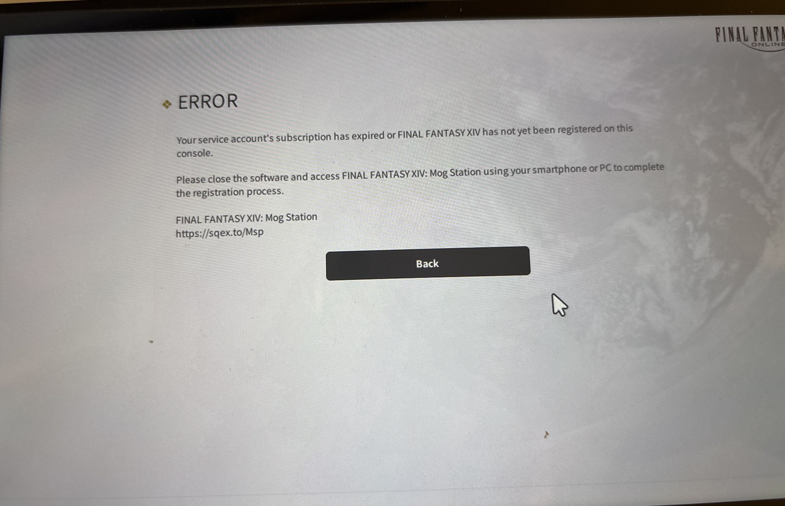
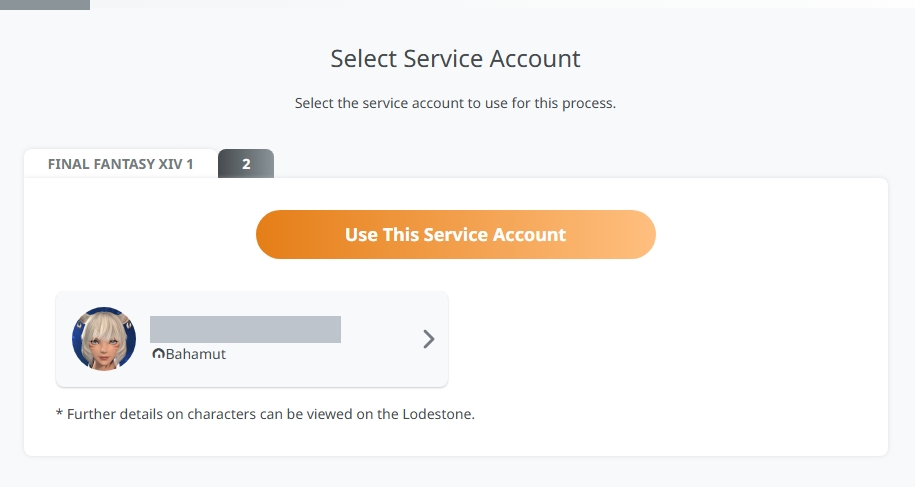
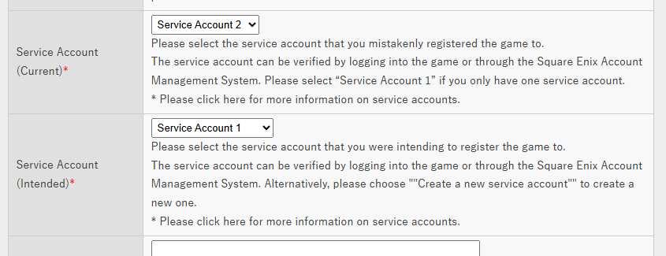
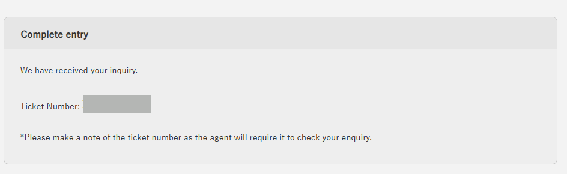
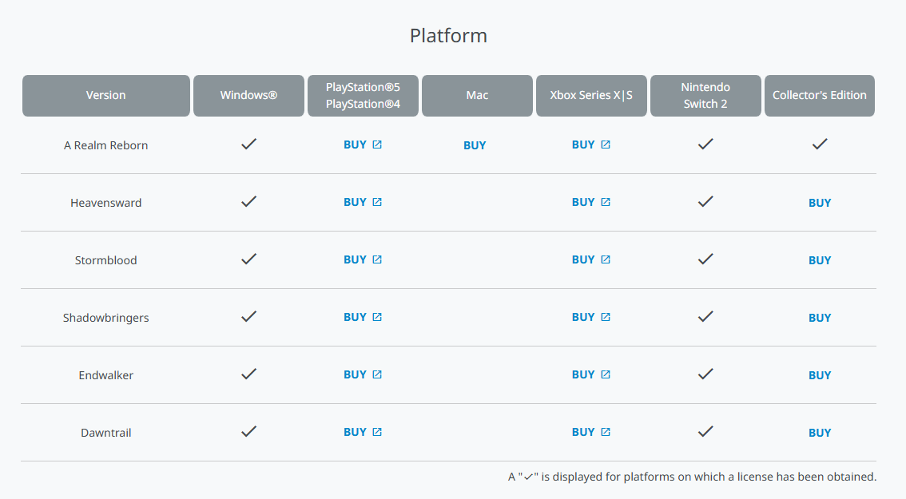

8/5 在 eShop 買了 FFXIV Switch 2 版的 Complete Edition，開遊戲登入 Square Enix 帳號。我明明選的是自己的FFXIV角色名，但它一直跳失敗，我在那邊反覆試，結果不知不覺就多建了一個新的 Service Account 出來。等我發現不對，我在 PC 養了好幾年的角色，已經不在遊戲讀到的那個帳號裡了。


*就是這個畫面，看到的當下心涼了一半*

上網查完更慌，一堆媒體都在講「Switch 2 首次啟動的帳號連結是永久、不可逆的」。不過後來發現我踩到的其實不是那個坑，前後花了十天把角色救回來了。這篇記一下過程，給之後同樣手殘的人看。

## 先搞清楚你踩到的是哪個坑

有兩件事很容易被混在一起：

**Nintendo 帳號 ↔ Square Enix 帳號的綁定，這個才是不可逆的。** 媒體警告的是這件事，如果你登入了錯誤的 SE 帳號，那真的沒救。

**Service Account 選錯是另一回事，官方有補救管道。** 一個 SE ID 底下可以開最多 8 個 service account，你的角色、訂閱、平台授權都掛在其中一個上面。我的 SE 帳號從頭到尾都是對的，只是 license 被註冊到新開的那個空帳號去了。


*上面那兩個分頁就是兩個 service account，角色只掛在 1 底下，2 是空的*

順帶一提這個坑也不是 Switch 2 才有，之前 PS 轉 Steam 的時候就有一批人中過招了。

## 表單

官方名稱叫 **Improperly Registered Service Account**，北美帳號從這裡送：

```
https://support.na.square-enix.com/contact.php?id=5382&la=1&daxx=2
```

（如果是綁錯 SE ID，那是另一張表單，網址結尾改成 `daxx=1`）

送出前有幾個條款要先知道：錯誤的那個 service account 會被永久停用，8 個名額就少一個；已經付掉的訂閱費不退；這是一次性服務，只能用一次；官方標示處理時間最長兩週。

### Registration Code 填 0

表單說明只寫「PlayStation Store 或 Microsoft Store 的數位版填 0」，完全沒提 Nintendo，我在這裡卡了很久。

後來想通了，eShop 數位版跟 PS/MS 一樣是 entitlement 綁帳號，根本不發序號，整個啟動流程也沒有哪一步要你輸入 16 碼。所以直接填 0 就對了，不要跟 eShop 儲值卡的序號搞混。

因為沒有序號可以給他們對，我就在說明欄把完整的 eShop 收據資訊貼上去：Transaction ID、購買日期、商品名稱、金額、Nintendo 帳號的 email。

### Current 和 Intended 不要填反

這兩欄很容易搞混：

- **Current** = 你不小心註冊上去的那個 → Service Account 2
- **Intended** = 你本來想註冊的那個 → Service Account 1


*Current 選 2、Intended 選 1，方向反了就是災難*

Current 欄下面那句「Please select "Service Account 1" if you only have one service account」是給另一種情況的人看的，別被它影響。判斷依據永遠是上面那句：你不小心註冊上去的是哪個。如果填反了，SE 會去停用你有角色的那個帳號，那就慘了。

### 其他欄位

姓名、地址、生日要跟 SE 帳號的登錄資料一字不差，這是拿來驗身分的。ZIP+4 如果不知道就留空，不要填一半。

我還主動在說明欄寫了「錯誤的那個帳號上沒有角色、也沒有其他授權」，這樣可以少一次來回問答。另外附上 Mog Station 的 Select Service Account 截圖也有幫助，一張圖就能同時證明兩個帳號存在、以及角色在哪一個。


*送出後會給一組 ticket number，之後所有往來都靠它*

## 實際流程跟我想的不太一樣

送出當天就收到人工回覆了，比想像中快很多。我回 Yes 之後，第二封信才把實際會怎麼處理講清楚，而且跟我以為的「幫你搬移」完全是兩回事：

1. SE 會把 license 從錯誤的帳號刪掉（不是搬移，是刪除）
2. 那個帳號暫時停權幾天
3. 你下次開遊戲時，註冊畫面會再跳出來一次
4. 這次由你自己選正確的 service account

所以決定成敗的動作其實還在你手上。所謂「一次性」，真正卡的是最後這一步，不是那張表單。

信裡還有一句我覺得應該用紅字寫：註冊畫面有可能在你收到完成通知之前就跳出來。要是你隨手點過去又選錯，那就真的沒了。所以在收到通知前，我完全沒去碰 Switch 2 上的遊戲。

還有，被停權的只是那個錯誤的帳號，PC 版完全不受影響，這段期間我照樣上線。

## 中間插曲：說完成了卻還是進不去

8/8 收到完成通知，開遊戲登入，結果直接跳錯誤：

```
Your service account's subscription has expired or FINAL FANTASY XIV
has not yet been registered on this console.
```

註冊畫面根本沒出現。這個錯誤訊息叫你去 Mog Station 完成註冊，但那是給 PC 版寫的通用文字，Switch 2 根本沒有序號可以輸入，照著它繞只是浪費時間。

真正該做的是去 Mog Station 診斷。切到正確的 service account，點 **Service Account Status**：

- **Subscription** 的 End Date → 我這邊是 9/3 到期、正常續訂，所以不是訂閱的問題
- 往下捲到 **Platform** → 這裡 **Nintendo Switch 2 沒有打勾**


到這邊就定位出來了：移除做完了，但重新發放沒做完。我完整關機重開、也確認 eShop 還是顯示已購買，試過都一樣，於是回報客服，信裡多加了一句：

> Since the registration screen never appears, I have had no opportunity
> to select a Service Account.

這句我是刻意寫的。註冊畫面沒出現，就代表我根本沒機會選錯，一次性的額度沒被用掉。這點不講清楚，萬一被判定成「你已經用掉機會了」就麻煩了。

客服請我再試一次，這次註冊畫面正常跳出來，角色回來了。


*看到這個勾才算真的結束*

## 時間軸

| 日期 | 事件 |
|---|---|
| 8/5 | 購買，首次啟動選錯 |
| 8/6 | 送表單，當天核准，回覆同意 |
| 8/8 | 通知完成，但登入仍報錯，回報客服 |
| 8/15 | 再試一次，成功 |

## 給遇到同樣狀況的人

- 別因為看到「不可逆」就放棄，那指的是 Nintendo 帳號綁定，不是這個。
- 等待期間不要開通 Switch 2 訂閱、不要課金、也不要在錯誤帳號上創角。條款寫明可能會依訂閱狀態駁回，趁免月費期間送件最乾淨。
- 不要重複送表單。想確認進度就用 ticket 編號去問，不要開新單。
- 一律用原本那封信回覆。我前後遇到三個不同的專員，他們是靠 thread 歷史接手的，記得每次都帶上 Ticket Number 和 Case ID。
- 最後那一步慢慢來。註冊畫面跳出來時，先確認三件事再按：標籤對不對、下面有沒有你的角色、平台清單對不對。不確定就退出遊戲，退出不會消耗任何東西，按錯才會。
- 事後回 Mog Station 驗收，Platform 那排看到 Nintendo Switch 2 打勾，才算真的結束。

整件事最讓我怕的就是「一次性」這三個字，我填完表單反覆確認了四五次同一個欄位。
